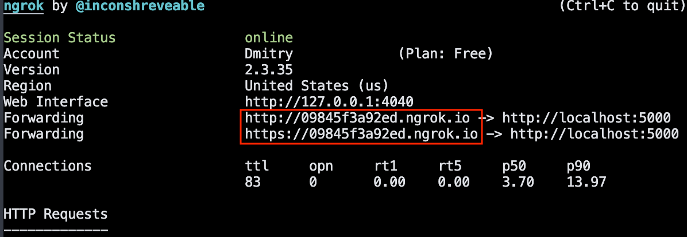

# Pizza facebook bot

The Facebook bot provides access to the pizza-shop. You can choose a pizza what you want, get a descriptions of chosen pizza with the picture, add the pizza to the cart, remove from the cart, and send the request for the payment. This bot use the api of [Elasticpath](https://www.elasticpath.com/) service (before this service was called Molton). For using the bot it has to create webhook, that is why this bot was created on Flask framework. 

All CRUD methods worked by API documentation.elasticpath.

## Get started

Before you begin, ensure you have met the following requirements:

- Programming language is [Python 3.8.1](https://www.python.org/downloads/release/python-381/).

- [Framework Flask](https://flask.palletsprojects.com/en/1.1.x/)

- All dependencies install from `pip install -r requirements.txt`.

- Create a page on the facebook.

- Create an application it is connected with your page. The full details  about creating and installing your application you can read on [Facebook for developers](https://developers.facebook.com/apps/).

You have to create on following resources:

- Online store in [Elasticpath](https://www.elasticpath.com/).

- Online database in [RedisLabs](https://redislabs.com).

Declare default environment variables in `.env` file:

`MOLTIN_CLIENT_ID` - Elasticpath client ID.

`MOLTIN_CLIENT_SECRET_TOKEN` - Elasticpath client secret token.

`DATABASE_PASSWORD` - Redis database password.

`DATABASE_HOST` - Redis database host.

`DATABASE_PORT` - Redis database port.

`PAGE_ACCESS_TOKEN` - your facebook page access token.

`VERIFY_TOKEN` - token, that facebook send for verification.

`MENU_IMAGE` - link of first page image from flask website.

`CATEGORY_IMAGE` - link of category page image from flask website.

`CART_IMAGE` - link of cart page image from flask website.

## How To Use

This is instruction for starting the bot on a local computer.

Before run it recommended to install virtual environment:

```bash
python3 -m venv env
source env/bin/activate
```

Because the facebook bot was based on the webhook and the facebook app need to connect to a server you need to emulate server on your local computer. You can use service [Ngrok](https://ngrok.com/download)

After install from your command line:

```bash
python app.py
./ngrok http PORT
```

The PORT you can see when you start `app.py`. For example - `Running on http://127.0.0.1:5000/`, where 5000 is your local port.

After launch the server check your ngrok status:



Local addresses is highlighted red line, but facebook app accept only `https protocol`.

Usage example:


## Description of files

Python scripts files:

| filename | description |
|----------|-----------|
|app.py|Webhook|
|fb_menu_keyboard.py|Provides the main menu keyboard|
|fb_help_message.py|Send help message|
|fb_add_to_cart_message.py|Add chosen pizza to cart and send message|
|fb_remove_from_cart_message.py|Remove chosen pizza from cart and send message|
|fb_cart_keyboard.py|Provide the cart keyboard|
|moltin.py|Interaction with moltin online-shop by APY request|
|moltin_token.py|Get the moltin access token and expiration time|
|check_moltin_menu.py|Script check the moltin menu changes and write it to database|
---

## License

You can copy, distribute and modify the software.

## Motivation

This project was created as part of online course for web developer [dvmn.org](https://dvmn.org/modules/).